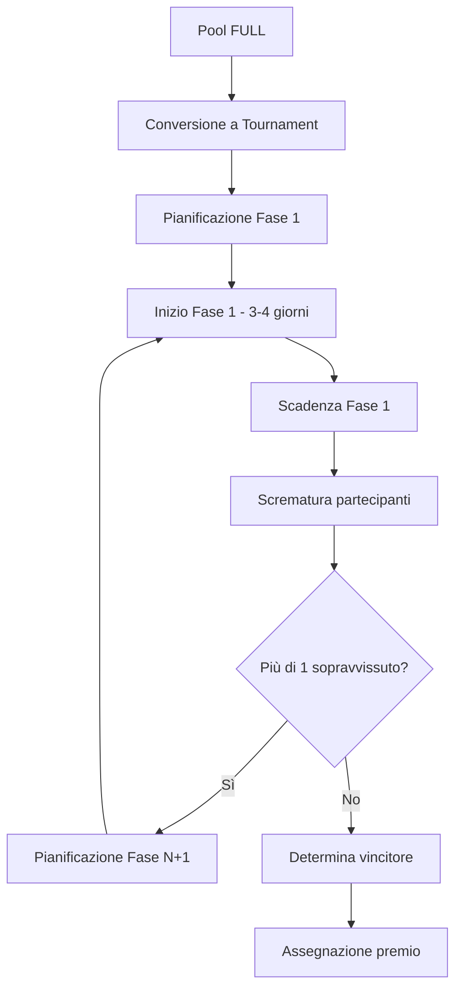

# Tickup – Game Architecture & Tournament Orchestrator

Questo documento riassume l'architettura completa dell'integrazione giochi nel frontend Flutter, 
l'orchestratore di tornei per le competizioni a fasi temporizzate e le linee guida per evolvere 
Pixel Adventure con sistema di torneo progressivo. È pensato come riferimento per designer, 
dev front/back e per la definizione del data model legato ai premi/pool.

---

## 1. Topologia del modulo giochi & orchestratore tornei

```
frontend/
├── lib/
│   ├── pixel_adventure.dart          # FlameGame configurabile (livelli, punteggio, timer)
│   ├── components/                   # Sprite, entità e logiche di collisione
│   └── presentation/pages/games/
│       ├── game_launcher.dart        # Lista giochi disponibili
│       ├── game_runner.dart          # Router → menu gioco
│       ├── pixel_adventure_menu.dart # Menu livelli Pixel Adventure
│       └── tournament/
│           ├── tournament_lobby.dart     # Lista tornei attivi/in attesa
│           ├── tournament_details.dart   # Dettaglio torneo con fasi
│           └── tournament_play.dart      # Interfaccia gioco nel torneo
└── assets/tiles/                     # Mappe TMX, tileset, asset grafici

backend/
├── models/
│   ├── tournament.py                 # Orchestratore principale tornei
│   ├── tournament_phase.py           # Fasi del torneo (eliminatorie)
│   ├── tournament_participant.py     # Partecipanti per fase
│   └── tournament_session.py         # Sessioni di gioco per fase
└── services/
    └── tournament_orchestrator.py    # Logica automazione fasi
```

### Architettura orchestratore:

- **TournamentLobby** mostra pool che sono diventati tornei (raggiunto il numero massimo)
- **TournamentDetails** visualizza le fasi, partecipanti qualificati e scadenze temporali  
- **TournamentPlay** integra i giochi esistenti ma nel contesto del torneo
- **TournamentOrchestrator** (backend) gestisce transizioni automatiche tra fasi
- I componenti gioco rimangono invariati, ma ora inviano risultati al sistema torneo

---

## 2. Workflow del sistema torneo

### 2.1 Stati del pool/torneo
```
OPEN → FULL → TOURNAMENT_READY → TOURNAMENT_ACTIVE → TOURNAMENT_COMPLETED
```

1. **OPEN**: Pool normale, accetta ticket
2. **FULL**: Raggiunto il numero massimo di partecipanti
3. **TOURNAMENT_READY**: Torneo pianificato (con data inizio)
4. **TOURNAMENT_ACTIVE**: Torneo in corso con fasi attive
5. **TOURNAMENT_COMPLETED**: Torneo terminato, vincitori determinati

### 2.2 Ciclo di vita del torneo



### 2.3 Meccanismi di eliminazione

Per ogni fase:
- **Top N%**: Passa alla fase successiva solo il top 50% dei giocatori
- **Soglia punteggio**: Passa chi supera un punteggio minimo
- **Soglia tempo**: Passa chi completa entro un tempo limite
- **Combinato**: Mix di criteri (es. completa + top 30% per tempo)

---

## 3. Schema relazionale esteso

### 3.1 Tabelle esistenti (modificate)

```sql
-- Estensione della tabella pools esistente
ALTER TABLE raffle_pool ADD COLUMN tournament_id UUID REFERENCES tournaments(id);
ALTER TABLE raffle_pool ADD COLUMN tournament_conversion_at TIMESTAMP;
```

### 3.2 Nuove tabelle orchestratore

```sql
tournaments
-----------
id (PK)
pool_id (FK -> raffle_pool, UNIQUE)
title VARCHAR(200)
description TEXT
status (enum: ready, active, completed, cancelled)
total_phases INTEGER
current_phase INTEGER
scheduled_start_at TIMESTAMP
created_at TIMESTAMP
completed_at TIMESTAMP

tournament_phases  
-----------
id (PK)
tournament_id (FK -> tournaments)
phase_number INTEGER
game_id (FK -> games)
level_id (FK -> levels) 
title VARCHAR(100)
description TEXT
duration_hours INTEGER (es. 72 = 3 giorni)
elimination_rule JSONB -- { "type": "top_percentage", "value": 50 }
min_score INTEGER
max_time_seconds INTEGER
status (enum: scheduled, active, completed, cancelled)
started_at TIMESTAMP
deadline_at TIMESTAMP
participants_count INTEGER
qualified_count INTEGER

tournament_participants
-----------
id (PK) 
tournament_id (FK -> tournaments)
phase_id (FK -> tournament_phases)
player_id (FK -> players)
qualified BOOLEAN DEFAULT FALSE
best_score INTEGER
best_time_seconds INTEGER  
sessions_count INTEGER DEFAULT 0
last_played_at TIMESTAMP
eliminated_at TIMESTAMP
qualified_at TIMESTAMP

tournament_sessions
-----------
id (PK)
tournament_id (FK -> tournaments) 
phase_id (FK -> tournament_phases)
participant_id (FK -> tournament_participants)
game_session_id (FK -> game_sessions)
-- eredita dati da game_sessions per performance queries

tournament_rewards
-----------
tournament_id (FK -> tournaments)
position INTEGER -- 1st, 2nd, 3rd place
reward_type (enum: prize, tickets, coins)
reward_value JSONB
percentage_share DECIMAL(5,2) -- se premio diviso
```

---

## 4. API orchestratore tornei

### 4.1 Gestione lifecycle

```python
# Conversione pool → torneo
POST /pools/{pool_id}/convert-to-tournament
{
    "title": "Pixel Adventure Championship",
    "phases": [
        {
            "game_code": "pixel_adventure",
            "level_code": "Level-01", 
            "duration_hours": 72,
            "elimination_rule": {"type": "top_percentage", "value": 50}
        },
        {
            "level_code": "Level-02",
            "duration_hours": 72, 
            "elimination_rule": {"type": "top_percentage", "value": 50}
        }
    ],
    "scheduled_start": "2025-11-01T10:00:00Z"
}

# Avvio manuale torneo
POST /tournaments/{id}/start

# Join a fase attiva (automatico se partecipante qualificato)
POST /tournaments/{id}/phases/{phase_id}/join
```

### 4.2 Monitoraggio e gaming

```python  
# Stato torneo completo
GET /tournaments/{id}
→ {
    "tournament": {...},
    "current_phase": {...},
    "my_status": "qualified" | "eliminated" | "active",
    "leaderboard": [...],
    "next_phase_info": {...}
}

# Classifica fase corrente
GET /tournaments/{id}/phases/{phase_id}/leaderboard

# Inizio sessione gioco in torneo  
POST /tournaments/{id}/phases/{phase_id}/sessions/start
→ game_session_id (collegato al sistema esistente)

# Fine sessione (usa endpoint esistente ma triggera logiche torneo)
POST /game-sessions/{id}/finish
```

---

## 5. Logica orchestratore backend

### 5.1 TournamentOrchestrator Service

```python
class TournamentOrchestrator:
    
    async def check_phase_deadlines(self):
        """Cron job ogni ora: controlla scadenze e avvia eliminazioni"""
        expired_phases = await self.get_expired_active_phases()
        
        for phase in expired_phases:
            await self.process_phase_elimination(phase)
            await self.setup_next_phase_or_complete_tournament(phase.tournament)
    
    async def process_phase_elimination(self, phase):
        """Applica regole eliminazione e segna qualified/eliminated"""
        participants = await self.get_phase_participants(phase.id)
        rule = phase.elimination_rule
        
        if rule['type'] == 'top_percentage':
            qualified_count = int(len(participants) * rule['value'] / 100)
            # Ordina per best_score DESC, best_time ASC
            sorted_participants = sorted(participants, key=lambda p: (-p.best_score, p.best_time_seconds))
            qualified = sorted_participants[:qualified_count]
        
        elif rule['type'] == 'min_score':
            qualified = [p for p in participants if p.best_score >= rule['value']]
            
        # Aggiorna DB
        await self.mark_participants_qualification(qualified, phase)
    
    async def setup_next_phase_or_complete_tournament(self, tournament):
        """Avvia fase successiva o completa torneo se ultima fase"""
        if tournament.current_phase < tournament.total_phases:
            await self.start_next_phase(tournament)
        else:
            await self.complete_tournament(tournament)
```

### 5.2 Automazione e notifiche

- **Cron job orario**: Verifica scadenze fasi e avvia eliminazioni
- **Webhook/WebSocket**: Notifica real-time ai partecipanti
- **Email/Push**: Promemoria inizio fase, eliminazioni, qualificazioni

---

## 6. Frontend integrazione torneo

### 6.1 Tournament Lobby

```dart
class TournamentLobby extends ConsumerWidget {
  Widget build(BuildContext context, WidgetRef ref) {
    final tournaments = ref.watch(activeTournamentsProvider);
    
    return tournaments.when(
      data: (tournamentList) => ListView.builder(
        itemBuilder: (context, index) {
          final tournament = tournamentList[index];
          return TournamentCard(
            tournament: tournament,
            onTap: () => context.push('/tournaments/${tournament.id}'),
          );
        },
      ),
    );
  }
}
```

### 6.2 Tournament Details

```dart
class TournamentDetailsPage extends ConsumerWidget {
  Widget build(BuildContext context, WidgetRef ref) {
    final tournament = ref.watch(tournamentProvider(tournamentId));
    
    return Column(
      children: [
        TournamentProgressBar(tournament: tournament),
        CurrentPhaseInfo(phase: tournament.currentPhase),
        if (tournament.myStatus == 'active')
          PlayPhaseButton(
            onPressed: () => _startGameSession(tournament.currentPhase),
          ),
        LeaderboardWidget(tournament: tournament),
        PhaseHistoryWidget(tournament: tournament),
      ],
    );
  }
}
```

### 6.3 Integrazione con PixelAdventure

```dart
// Modifica minima: aggiungere contesto torneo
PixelAdventure(
  levels: [tournament.currentPhase.levelCode],
  initialLevelIndex: 0,
  // Callback speciale per tornei
  onSessionFinished: (result) {
    if (tournamentContext != null) {
      _submitTournamentSession(tournamentContext, result);
    } else {
      _handleNormalGameEnd(result);
    }
  },
)
```

---

## 7. Livelli TMX (invariati)

- Cartella: `frontend/assets/tiles`
- Nomenclatura: `Level-01.tmx`, `Level-02.tmx`, …
- Ogni mappa deve includere almeno i layer:
  - `Background` (tile layer, proprietà opzionale `BackgroundColor`)
  - `Spawnpoints` (objectgroup con oggetti `Player`, `Fruit`, `Checkpoint`, `Chicken`, `Saw`)
  - `Collisions` (objectgroup con rettangoli solidi e `type="Platform"` per piattaforme passanti)

---

## 8. Timer e punteggio (design invariato)

### 8.1 Timer
1. Aggiungere in `PixelAdventure` un campo `double remainingTime` (es. 120.0 secondi).
2. Aggiornare `update(dt)` sottraendo `dt`. Quando `remainingTime <= 0`:
   - Fermare input (`player.horizontalMovement = 0`, `player.hasJumped = false`)
   - Mostrare overlay "Tempo scaduto"
   - Invocare callback verso il menu (`onGameOver`) per registrare la sessione.

### 8.2 Punteggio
1. Introdurre `int score` nel game e metodo `addScore(int delta)`.
2. Nei componenti:
   - `Fruit.collidedWithPlayer()` → `gameRef.addScore(fruitValue);`
   - `Chicken.collidedWithPlayer()` → se il player lo stompa: `addScore(enemyKillValue);`

### 8.3 Fine partita  
Workflow aggiornato per tornei:
1. `PixelAdventure` chiama `widget.onSessionFinished(SessionResult result)`.
2. Se in modalità torneo: invia risultato al backend e mostra status qualificazione
3. Se modalità normale: comportamento originale (rigioca, scegli livello, ecc.)

---

## 9. TODO roadmap aggiornata

| Priorità | Attività                                                                       | Stato |
|----------|--------------------------------------------------------------------------------|-------|
| **ALTA** | **Sistema Torneo Backend**                                                     |       |
| Alta     | Creare modelli DB per tornei (tournament, phases, participants, sessions)     | ☐     |
| Alta     | Implementare TournamentOrchestrator service con logiche eliminazione          | ☐     |
| Alta     | API REST per gestione tornei e conversione pool→torneo                       | ☐     |
| Alta     | Cron job automatico per scadenze fasi e progressioni                          | ☐     |
| **ALTA** | **Sistema Torneo Frontend**                                                    |       |
| Alta     | Tournament Lobby page con lista tornei attivi                                 | ☐     |
| Alta     | Tournament Details page con fasi, classifica e stato personale               | ☐     |
| Alta     | Integrazione PixelAdventure con contesto torneo                               | ☐     |
| Alta     | Providers Riverpod per gestione stato tornei                                  | ☐     |
| **MEDIA** | **Miglioramenti Gioco**                                                       |       |
| Media    | Implementare `Score HUD` e `Timer` in `PixelAdventure`                        | ☐     |
| Media    | Creare overlay "Game Over / Timeout" e callback verso il menu                | ☐     |
| Media    | Notifiche push per inizio fasi, eliminazioni e qualificazioni                | ☐     |
| **BASSA** | **Analytics & Ottimizzazioni**                                                |       |
| Bassa    | Dashboard admin per monitoraggio tornei                                       | ☐     |
| Bassa    | Persistenza eventi dettagliati (collect/kill) per analytics/anti-cheat       | ☐     |
| Bassa    | Sistema di replay delle partite                                               | ☐     |

---

## 10. Esempio pratico: Flusso completo

### Scenario: Pool "Super Pixel Adventure" 
1. **Pool creation**: Creato pool per Nintendo Switch (premio), richiede 32 giocatori
2. **Riempimento**: Dopo 2 settimane, 32° giocatore compra ticket → pool diventa FULL
3. **Conversione**: Admin o automatismo converte pool in torneo 3 fasi:
   - Fase 1: Level-01, 3 giorni, passa top 50% (16 giocatori)  
   - Fase 2: Level-02, 3 giorni, passa top 50% (8 giocatori)
   - Fase 3: Level-03, 4 giorni, determina vincitore finale
4. **Esecuzione**:
   - Notifica ai 32 giocatori: "Il tuo pool è diventato torneo! Fase 1 inizia domani"
   - Fase 1 inizia: 3 giorni per completare Level-01, ognuno può giocare multiple volte
   - Scadenza Fase 1: Orchestratore calcola top 16, elimina altri 16
   - Fase 2 inizia: Solo i 16 qualificati possono giocare Level-02  
   - ... e così via fino al vincitore finale

### Benefici:
- **Engagement prolungato**: invece di una lotteria istantanea, 7-10 giorni di competizione
- **Skill-based**: vince chi è più bravo, non solo fortuna
- **Suspense**: eliminazioni progressive creano tensione
- **Community**: classifiche e rivalità tra giocatori

---

## 11. Riferimenti utili

- [Documentazione Flame](https://docs.flame-engine.org/latest/)
- [FastAPI Background Tasks](https://fastapi.tiangolo.com/tutorial/background-tasks/)
- [PostgreSQL Triggers per automazioni](https://www.postgresql.org/docs/current/triggers.html)
- [Supabase Realtime per notifiche](https://supabase.com/docs/guides/realtime)
- [Riverpod state management](https://riverpod.dev)

Per dubbi o proposte di modifica, aprire una issue o discutere nel canale #tournament-dev interno.